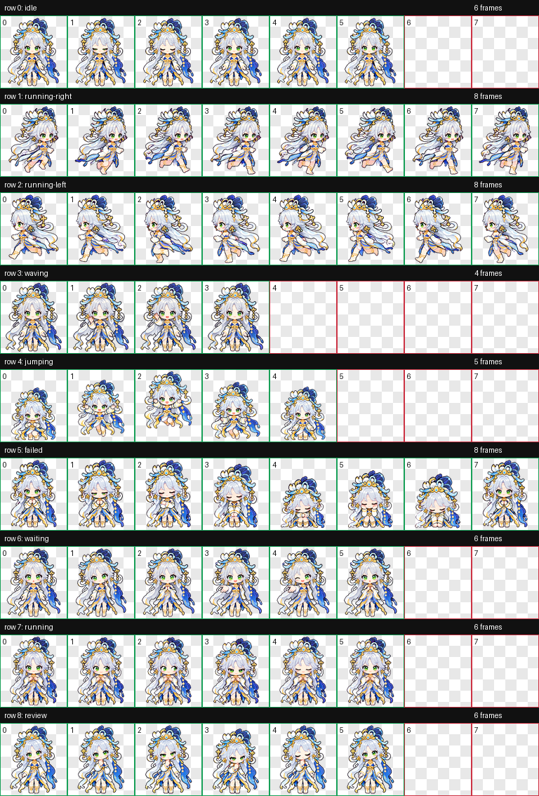

# 嫦娥落星盏 · 像素 Q 版 Codex Pet

银白发、青绿眼睛与蓝白金衣饰的嫦娥桌面伙伴。


## 动作与表情

共九种状态、57 帧：待机眨眼、向右移动、向左移动、挥手、跳跃、失败反应、等待输入、专注工作、思考审阅。左右移动分别制作以保留不对称衣饰；工作状态表现原地专注处理任务。



## 文件

- `pet.json`：宠物配置。
- `spritesheet.webp`：1536 × 1872 透明无损 WebP，8 列 × 9 行，每格 192 × 208。
- 根目录中的九个 `.gif` 文件：逐项动作预览。
- `install.sh` / `install.ps1`：macOS、Linux / Windows 安装脚本。

本版采用九行图集，不声明 v2 或 16 方向注视。

## 安装

下载并解压本仓库。macOS / Linux 在解压目录运行：

```sh
sh install.sh
```

Windows PowerShell：

```powershell
powershell -ExecutionPolicy Bypass -File .\install.ps1
```

也可将 `pet.json` 和 `spritesheet.webp` 放入 `$CODEX_HOME/pets/change-starlight-cup`；未设置 CODEX_HOME 时使用 `~/.codex/pets/change-starlight-cup`。Windows 默认目录为 `%USERPROFILE%\.codex\pets\change-starlight-cup`。
