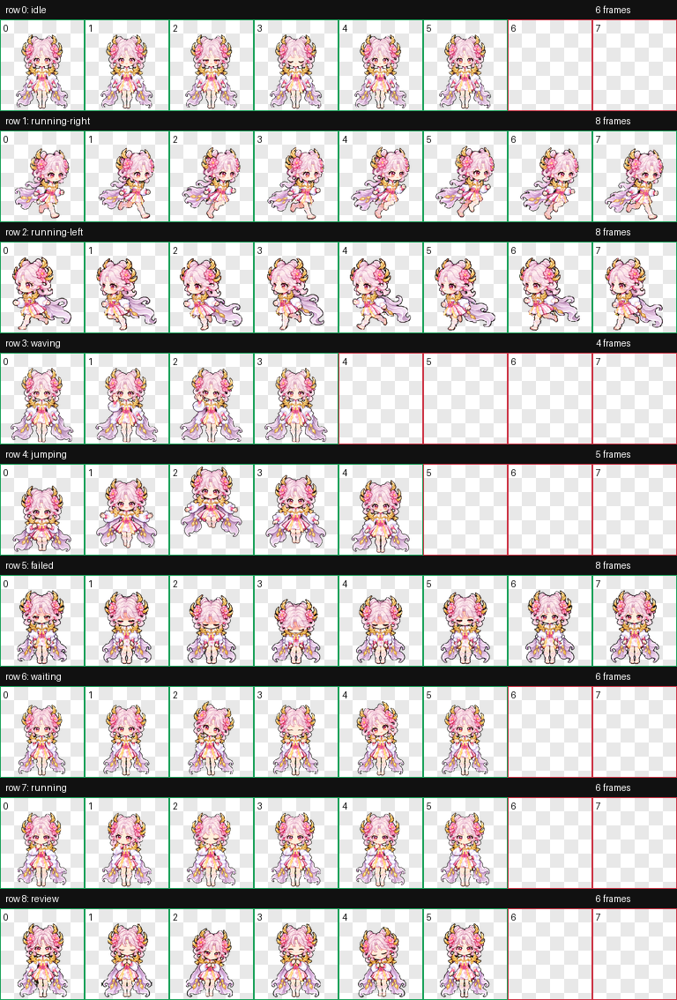

# 嫦娥·拒霜思 · Codex Pet

[← 返回宠物目录](../../README.md)

粉紫盘发、芙蓉花饰、粉白衣裙与金色肩饰的像素 Q 版桌面伙伴。身后的浅紫轻纱自然垂落、末端轻卷，随动作柔和摆动。

 

## 安装

[下载整个仓库](https://github.com/Aurora-Selene/Codex-pet-Change-from-HOK/archive/refs/heads/main.zip)，解压后进入 `pets/change-jushuangsi`。

macOS / Linux：

```sh
sh install.sh
```

Windows PowerShell：

```powershell
powershell -ExecutionPolicy Bypass -File .\install.ps1
```

也可以手动将 [pet.json](pet.json) 和 [spritesheet.webp](spritesheet.webp) 放进 `~/.codex/pets/change-jushuangsi/`；Windows 默认目录为 `%USERPROFILE%\.codex\pets\change-jushuangsi`。设置了 `CODEX_HOME` 时使用其下的 `pets/change-jushuangsi`。各款宠物使用不同 ID，可以同时安装。安装后刷新 Codex 宠物列表，必要时重新启动。

## 九个动作

### 安静待机


### 向右移动


### 向左移动


### 挥手致意


### 轻盈跳跃


### 小小受挫


### 等待回应


### 专心工作


### 细看成果


## 完整动作总览



共九种状态、57 帧，图集为 1536 × 1872 透明 WebP。左右移动分别绘制；跳跃保留起落位移。已检查图集、透明背景、逐帧造型和动作预览；实际悬浮宠物窗口未现场播放验证。
