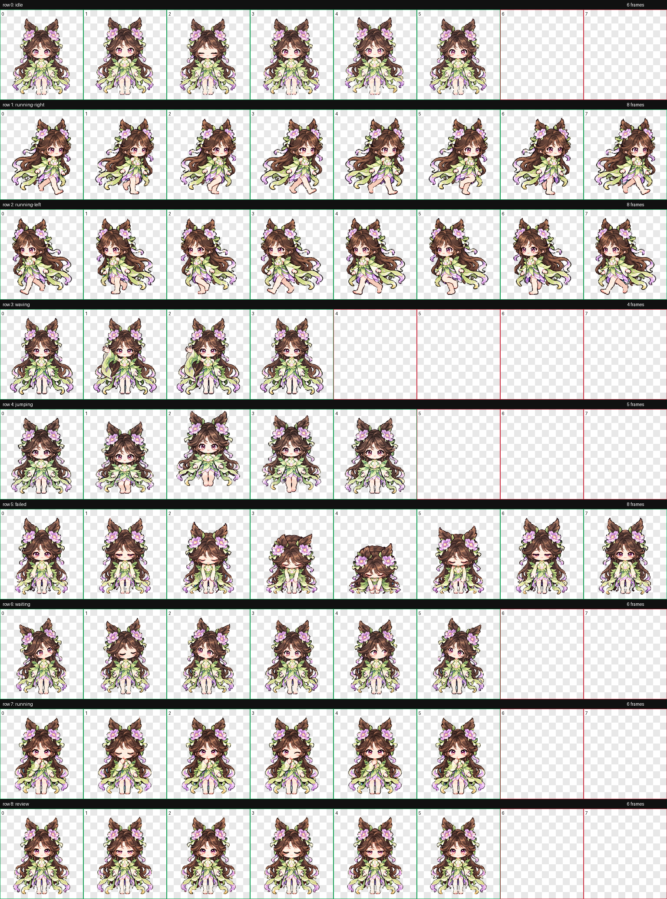

# 嫦娥·露花倒影 · Codex Pet

[← 返回宠物目录](../../README.md) · [落星盏](../change-starlight-cup/README.md) · [如梦令](../change-rumengling/README.md) · [寒月公主（原皮）](../change-classic/README.md)

深棕长发、紫色花饰与青绿荷叶衣裙的像素 Q 版桌面伙伴。当前为移动动作修订版：左右移动各有八个独立步态，加入屈膝、抬脚与落脚变化。

 

## 安装

[下载整个仓库](https://github.com/Aurora-Selene/Codex-pet-Change-from-HOK/archive/refs/heads/main.zip)，解压后进入 `pets/change-luhuadaoying`。

macOS / Linux：

```sh
sh install.sh
```

Windows PowerShell：

```powershell
powershell -ExecutionPolicy Bypass -File .\install.ps1
```

也可以手动将 [pet.json](pet.json) 和 [spritesheet.webp](spritesheet.webp) 放进 `~/.codex/pets/change-luhuadaoying/`；Windows 默认目录为 `%USERPROFILE%\.codex\pets\change-luhuadaoying`。设置了 `CODEX_HOME` 时使用其下的 `pets/change-luhuadaoying`。各款宠物使用独立 ID，可以同时安装。安装后刷新 Codex 宠物列表，必要时重新启动。

## 九个动作

### 安静待机


### 向右移动


### 向左移动


### 挥手致意


### 轻盈跳跃


### 小小受挫


### 等待回应


### 专心工作


### 细看成果


## 完整动作总览



共九种状态、57 帧，图集为 1536 × 1872 透明 WebP，8 列 × 9 行，每格 192 × 208。移动动作已更新，其余七种动作保持原版。已检查图集尺寸、透明背景、预览帧数和文件一致性；实际悬浮宠物窗口未现场播放验证。
