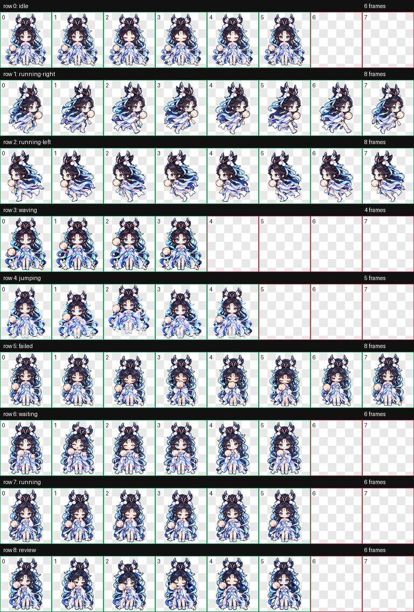

# 嫦娥·如梦令 · Codex Pet

[← 返回两个宠物的目录](../../README.md) · [查看另一个宠物](../change-starlight-cup/README.md)

黑发、蓝白梦衣与桃色团扇的像素 Q 版桌面伙伴。团扇小幅轻挥；跳跃采用双腿靠拢、轻压膝起落，并保留手臂与团扇摆动。

 

## 安装

[下载整个仓库](https://github.com/Aurora-Selene/Codex-pet-Change-from-HOK/archive/refs/heads/main.zip)，解压后进入 `pets/change-rumengling`。

macOS / Linux：

```sh
sh install.sh
```

Windows PowerShell：

```powershell
powershell -ExecutionPolicy Bypass -File .\install.ps1
```

也可以手动将 [pet.json](pet.json) 和 [spritesheet.webp](spritesheet.webp) 放进 `~/.codex/pets/change-rumengling/`；Windows 默认目录为 `%USERPROFILE%\.codex\pets\change-rumengling`。设置了 `CODEX_HOME` 时使用其下的 `pets/change-rumengling`。两个宠物使用不同 ID，可以同时安装。安装后刷新 Codex 宠物列表，必要时重新启动。

## 九个动作

### 安静待机


### 向右移动


### 向左移动


### 团扇致意


### 轻盈跳跃


### 小小受挫


### 等待回应


### 专心工作


### 细看成果


## 完整动作总览



共九种状态、57 帧，图集为 1536 × 1872 透明 WebP。已检查图集、透明背景与动作预览；实际悬浮宠物窗口未现场播放验证。
